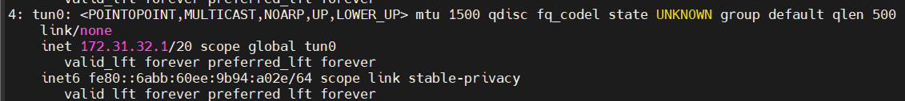

# OpenVPN OTP Authentication


## Mục tiêu:
**- Cài đặt và thiết lập cấu hình OpenVPN server 2.5.7 trên server Ubuntu 22.04**

**- OpenVPN với Plugin OpenVPN-OTP và Google Authenticator**

**- Script auto tạo config client và QR**

**- Vận hành OpenVPN Server 2.5.7**
## Điều kiện kiên quyết (tối thiểu để lab):
**- Server Ubuntu 22.04 LTS tối thiểu 1 vCPU, 1 GB RAM**

**- User Root hoặc có quyền Root của server**

## Tài liệu tham khảo:
- https://community.openvpn.net/openvpn/wiki/OpenvpnSoftwareRepos
- https://kifarunix.com/install-and-setup-openvpn-server-on-ubuntu-22-04/
- https://kifarunix.com/install-and-configure-openvpn-client-on-centos-8-ubuntu-18-04/
- https://123host.vn/tailieu/kb/vps/huong-dan-cai-dat-openvpn-voi-otp-google-authenticator.html
- https://github.com/evgeny-gridasov/openvpn-otp

## I. Upgrade, Install and Setup OpenVPN Server 2.5.7 on Ubuntu 22.04
### 1. Upgrade and Install OpenVPN apt repositories
Mặc định trên Ubuntu 22.04 LTS chỉ chứa ver 2.5.5, chúng ta cần cập nhật lại repo để sử dụng version mới hơn của OpenVPN
```console
mkdir -p /etc/apt/keyrings && curl -fsSL https://swupdate.openvpn.net/repos/repo-public.gpg | gpg --dearmor > /etc/apt/keyrings/openvpn-repo-public.gpg
```
```console
echo "deb [arch=amd64 signed-by=/etc/apt/keyrings/openvpn-repo-public.gpg] http://build.openvpn.net/debian/openvpn/release/2.5 jammy main" > /etc/apt/sources.list.d/openvpn-aptrepo.list
```
```console
apt-get update && apt-get install openvpn=2.5.7-jammy0
```
### 2. Install Easy-RSA CA Utility on Ubuntu 22.04
Easy-RSA package cung cấp tiện tích để tạo các cặp key SSL được sử dụng để bảo mật các kết nối VPN
```console
apt install easy-rsa
```
### 3. Create OpenVPN Public Key Infrastructure
Khi đã cài đặt easy-rsa, bạn cần khởi tạo OpenVPN PKI bao gồm:
- **Public key** và **private key** cho server và từng client
- 1 master Certificate Authority (CA) được sử dụng để kí cho từng server và client
 
Sao chép thư mục cấu hình easy-rsa sang một vị trí khác để đảm bảo rằng các bản nâng cấp gói OpenVPN trong tương lai sẽ không ghi đè lên các sửa đổi của bạn
```console
cp -r /usr/share/easy-rsa /etc/
```
Khởi tạo PKI:
```console
cd /etc/easy-rsa/
./easyrsa init-pki
```
Khi PKI được khởi tạo sẽ nằm trong **/etc/easy-rsa/pki**

Generate the Certificate Authority (CA) Certificate and Key (Tạo cert CA và key để ký cert ứng dụng khách và máy chủ OpenVPN)
```console
./easyrsa build-ca
```
Nhập passphrase của CA và tên chung của server. Cert CA được tạo và lưu trữ tại **/etc/easy-rsa/pki/ca.crt**

- Thêm **nopass** vào cuối để vô hiệu hóa việc sử dụng passphrase nếu không muốn bảo mật nâng cao

Generate Diffie Hellman Parameters (Tạo các key Diffie-Hellman được sử dụng để trao đổi key trong quá trình bắt tay TLS giữa máy chủ OpenVPN và các client đang kết nối)
```console
./easyrsa gen-dh
```
Tham số DH có kích thước 2048 được tạo tại **/etc/easy-rsa/pki/dh.pem**
### 4. Generate OpenVPN Server Certificate and Key
Để tạo cert và private key cho máy chủ OpenVPN, hãy chạy lệnh bên dưới
```console
./easyrsa build-server-full server
```
Nhập passphrase CA đã tạo ở trên để tạo cert và key (thêm **nopass** vào cuối để vô hiệu hóa passphrase nếu bước 3 sử dụng)
### 5. Generate Hash-based Message Authentication Code (HMAC) key
Khóa xác thực pre-shared TLS/SSL được sử dụng làm chữ ký HMAC bổ sung trên tất cả các gói bắt tay SSL/TLS để tránh tấn công DoS và tràn cổng UDP
```console
openvpn --genkey secret /etc/easy-rsa/pki/ta.key
```
### 6. Generate OpenVPN Revocation Certificate
Để làm mất hiệu lực cert đã ký trước đó, bạn cần tạo cert thu hồi. Chạy tập lệnh trong thư mục Easy-RSA
```console
./easyrsa gen-crl
```
Cert thu hồi được tạo và lưu trữ tại **/etc/easy-rsa/pki/crl.pem**
### 7. Copy Server Certificates and Keys to Server Config Directory
Sao chép tất cả các cert/key đã tạo vào thư mục cấu hình máy chủ OpenVPN
```console
cp -rp /etc/easy-rsa/pki/{ca.crt,dh.pem,ta.key,crl.pem,issued,private} /etc/openvpn/server/
```
### 8. Generate OpenVPN Client Certificates and Keys
Cert client OpenVPN và private key có thể được tạo như sau:
```console
./easyrsa build-client-full test
```
- **test** là tên user client
- Luôn sử dụng một user chung duy nhất cho từng client mà bạn đang tạo cert và key
```console
./easyrsa build-client-full test2
```
Tương tự nếu muốn tạo thêm user client thứ 2, 3... Bạn có thể xem cách sử dụng lệnh **easyrsa** với **./easyrsa --help**
### 9. Copy Client Certificates and Keys to Client Directory
Tạo thư mục cho client OpenVPN

Ví dụ: Tạo thư mục cho 2 client là **test** và **test2**
```console
mkdir /etc/openvpn/client/{test,test2}
```
Sau đó, sao chép cert/key của client vào thư mục cấu hình client OpenVPN
```console
cp -rp /etc/easy-rsa/pki/{ca.crt,ta.key,issued/test.crt,private/test.key} /etc/openvpn/client/test
```
```console
cp -rp /etc/easy-rsa/pki/{ca.crt,ta.key,issued/test2.crt,private/test2.key} /etc/openvpn/client/test2
```
### 10. Configure OpenVPN Server on Ubuntu 22.04
Bước tiếp theo là cấu hình máy chủ OpenVPN. Sao chép cấu hình máy chủ OpenVPN mẫu vào **/etc/openvpn/server** thư mục như hình bên dưới

Mẫu cấu hình nằm trong **/usr/share/doc/openvpn/examples/sample-config-files** file **server.conf**. Nếu nó được nén **.gz** thì cần unzip **gzip -d server.conf.gz**
```console
cp /usr/share/doc/openvpn/examples/sample-config-files/server.conf /etc/openvpn/server/
```
Trích xuất cấu hình và sửa đổi nó để phù hợp với nhu cầu của bạn. Cấu hình được **comment #** để giúp bạn hiểu cách sử dụng tùy chọn khác nhau.

Tạo folder **ccd** để lưu cấu hình **link-mtu** cho client
```console
cd /etc/openvpn/ && mkdir ccd && echo "link-mtu 1500" > ccd/all_os
```
Đây là cấu hình mẫu khi không có bình luận. Bạn có thể copy và sử dụng chúng
```console
nano server/server.conf
```

```console
port 1194
proto udp4
dev tun
ca ca.crt
cert issued/server.crt
key private/server.key  # This file should be kept secret
dh dh.pem
topology subnet
server 172.31.32.0 255.255.240.0
ifconfig-pool-persist /var/log/openvpn/ipp.txt
#push "redirect-gateway def1 bypass-dhcp"
push "dhcp-option DNS 8.8.8.8"
push "dhcp-option DNS 8.8.4.4"
client-to-client
keepalive 10 120
tls-auth ta.key 0 # This file is secret
cipher AES-256-CBC
persist-key
persist-tun
status /var/log/openvpn/openvpn-status.log
log-append  /var/log/openvpn/openvpn.log
verb 3
explicit-exit-notify 1
auth SHA512
keysize 128
mssfix
client-config-dir /etc/openvpn/ccd
script-security 2
mtu-disc yes
tun-mtu-extra 32
user nobody
group nogroup
```
### 11. Configure OpenVPN IP Forwarding
Để đảm bảo rằng lưu lượng truy cập từ client được định tuyến thông qua địa chỉ IP của máy chủ OpenVPN (giúp che dấu địa chỉ IP của máy khách), bạn cần bật chuyển tiếp IP trên máy chủ OpenVPN

Bỏ ghi chú dòng **net.ipv4.ip_forward=1** trong **/etc/sysctl.conf** để bật chuyển tiếp gói cho IPv4
```console
sed -i 's/#net.ipv4.ip_forward=1/net.ipv4.ip_forward=1/' /etc/sysctl.conf
```
Áp dụng các thay đổi mà không cần khởi động lại máy chủ
```console
sysctl --system
```
### 12. Running OpenVPN Server on Ubuntu 22.04
Bắt đầu và kích hoạt máy chủ OpenVPN để chạy khi khởi động hệ thống
```console
systemctl enable --now openvpn-server@server
```
Kiểm tra trạng thái
```console
systemctl status openvpn-server@server
```
Khi dịch vụ OpenVPN chạy, nó sẽ tạo giao diện đường hầm (**Tunnel interface**) tun0
```console
ip a
```


Ngoài ra, hãy nhớ kiểm tra logs
```console
tail -f /var/log/openvpn/openvpn.log
```


Máy chủ OpenVPN hiện đã sẵn sàng.

### 13. Allow port OpenVPN and Configure IP Masquerading
Mở port **UDP 1194** cho phép client và server OpenVPN kết nối với nhau trên **Security groups**

Để cho phép OpenVPN đi qua tường lửa, bạn cần kích hoạt **masquerading**, một khái niệm iptables cung cấp dịch địa chỉ mạng động (NAT) để định tuyến chính xác các kết nối máy khách. Khi bất cứ lưu lượng truy cập nào đến từ VPN đều được chuyển tiếp đến card mạng chính để ra ngoài internet.
```console
iptables -I FORWARD -i tun0 -j ACCEPT
iptables -I FORWARD -o tun0 -j ACCEPT
iptables -I OUTPUT -o tun0 -j ACCEPT
iptables -A FORWARD -i tun0 -o eth0 -j ACCEPT
iptables -t nat -A POSTROUTING -o eth0 -j MASQUERADE
iptables -t nat -A POSTROUTING -s 172.31.32.0/20 -o eth0 -j MASQUERADE
```
**Chú ý**: Thay đổi card mạng **eth0** và **IP card tunnel** cho hợp lệ

## II. OpenVPN OTP Authentication support
Thông thường, OpenVPN cho phép cấu hình sử dụng tài khoản, mật khẩu trên Client để đăng nhập vào OpenVPN. Đây là một bước bảo mật rất tốt và cần thiết, tuy nhiên ta có thể tăng mức độ bảo mật lên cao hơn bằng cách cấu hình cho Client sử dụng OTP cho mỗi lần đăng nhập (Mật khẩu sử dụng một lần).

Ở bài viết này thì mình sẽ hướng dẫn cài đặt OpenVPN với Plugin OpenVPN-OTP và Google Authenticator.

Plug-in này thêm hỗ trợ cho mã OTP (TOTP) dựa trên thời gian và HMAC dựa trên OTP (HOTP) cho OpenVPN. Tương thích với phần mềm Google Authenticator

### 1. Cài đặt các Package phụ thuộc mà Plugin yêu cầu
```console
apt-get install autoconf make libssl-dev libtool git -y
```
### 2. Cài đặt Pluggable Authentication Module Google Authenticator
```console
apt install libpam-google-authenticator -y
```
### 3. Download Plugin OpenVPN-OTP
```console
git clone https://github.com/evgeny-gridasov/openvpn-otp
```
### 4. Setup và config Plugin
Truy cập vào thư mục chứa source code Plugin để tiến hành tạo Configuration và Makefiles
```console
cd openvpn-otp/ && ./autogen.sh
```
Build và cài đặt Plugin OpenVPN-OTP
```console
./configure --prefix=/usr && make install
```
Sau khi hoàn tất cài đặt thông thường OpenVPN-OTP sẽ được install tại **/usr/lib/openvpn**


### 5. Config cho OpenVPN sử dụng Plugin OpenVPN-OTP
Truy cập vào vào file cấu hình của OpenVPN
```console
nano /etc/openvpn/server/server.conf
```
Do cứ mỗi 3600s mặc định OpenVPN ta sẽ cần nhập lại thông tin nên ta thêm dòng sau để tắt tính năng này đi
```console
#Disable username/password renegotiation
reneg-sec 0
```
Cấu hình OpenVPN sử dụng Plugin OpenVPN-OTP

- Đối với phiên bản **OpenVPN <= 2.3.x**
    ```console
    plugin /usr/lib/openvpn/openvpn-otp.so
    ```
- Đối với phiên bản **OpenVPN >= 2.4.x**
    ```console
    plugin "/usr/lib/openvpn/openvpn-otp.so"
    ```
Mẫu sau khi cấu hình xong sẽ như sau:


Sau đó lưu lại và khởi động lại OpenVPN để cấu hình được lưu:
```console
systemctl restart openvpn-server@server.service
```
### 6. Tạo file chứa cấu hình User và OTP
Mặc định thì OpenVPN-OTP sẽ sử dụng file sau **/etc/ppp/otp-secrets**
```console
mkdir /etc/ppp && touch /etc/ppp/otp-secrets
```
Sử dụng Google Authenticator đã được cài đặt để tạo key. Mẫu câu lệnh như sau:
```console
google-authenticator --time-based --disallow-reuse --force --rate-limit=3 --rate-time=30 --window-size=17 --issuer=Lab --label=user@hostname --secret=/root/.user.google_authenticator > /root/user.auth
```
- **--issuer**: là tên tổ chức của bạn (Khi quét QR nó sẽ đứng đầu tiên)
- **user**: là tên user client đã tạo lúc setup OpenVPN (test, test2)
- **hostname**: là tên của server OpenVPN

Tạo User **test** với hostname hiện tại của VPS là **openvpn** thì câu lệnh sẽ là:
```console
google-authenticator --time-based --disallow-reuse --force --rate-limit=3 --rate-time=30 --window-size=17 --issuer=Lab --label=test@openvpn --secret=/root/.test.google_authenticator > /root/test.auth
```
**Nếu command line không tự kết thúc thì sử dụng "Ctrl C" để thoát**

Tương tự với User **test2**:
```console
google-authenticator --time-based --disallow-reuse --force --rate-limit=3 --rate-time=30 --window-size=17 --issuer=Lab --label=test2@openvpn --secret=/root/.test2.google_authenticator > /root/test2.auth
```


Tiếp đến kiểm tra file **test.auth**, **test2.auth** để lấy key và đường link truy cập để quét mã QR tương ứng với key bằng App Google Authenticator


### Phần sử dụng link truy cập quét mã QR sẽ có trong tài liệu setup client OpenVPN và được gửi cho người dùng

Tiếp theo, cấu hình cho OpenVPN-OTP sử dụng key (OTP và không có mã PIN)
```console
nano /etc/ppp/otp-secrets
```
```console
#Use sha1/base32 for Google Authenticator without a pin
test openvpn totp:sha1:base32:2I72CYTL2XN4OA4BSV57HNGO54::xxx *
test2 openvpn totp:sha1:base32:5N4CH66GGIVPL3XEHGHJWIWNXI::xxx *
```
=> Đến đây coi như đã hoàn tất việc cài đặt cấu hình OpenVPN với Plugin OpenVPN-OTP trên Server

## III. Script create, config client and generate qr code 
### Trường hợp 1: Sử dụng passphrase
- Cần cài đặt package **expect**
- Tạo folder **/root/users_vpn**
- Tạo folder **/root/secret_otp**

    Click here [**Shell Script**](gen_user_vpn_passphrase.sh)
### Trường hợp 2: Nopass (không sử dụng passphrase)
- Tạo folder **/root/users_vpn**
- Tạo folder **/root/secret_otp**

    Click here [**Shell Script without passphrase**](gen_user_vpn_nopass.sh)
## IV. Tài liệu này sẽ hướng dẫn cách cài đặt và cấu hình Client OpenVPN
**- Cài đặt và thiết lập cấu hình OpenVPN 2.5.7 trên Windows 10**

**- Cài đặt và thiết lập cấu hình OpenVPN 2.5.7 trên Ubuntu 20.04**

**- Cài đặt và thiết lập cấu hình OpenVPN Connect v3 trên MacOS**

### Điều kiện kiên quyết:
**- Liên hệ với admin để được cấp:** 
1. **Folder config**
2. **User login**
3. **Link quét mã QR code Google Authenticator**

**- Cung cấp đúng thông tin OS đang sử dụng cho admin (Windows, Linux or MacOS)**

**- Trên điện thoại cá nhân đã cài app Google Authenticator**

**- Chú ý cài đúng version OpenVPN 2.5.7 để tránh lỗi không mong muốn**

### 1. Dowload and Install, Setup OpenVPN on Windows 10
#### Ví dụ: Sử dụng folder config và account user **test**
Download OpenVPN version 2.5.7 [tại đây](https://openvpn.net/community-downloads/)


Install default


Sử dụng folder config OpenVPN do admin cấp
Trong folder admin gửi sẽ gồm 5 file (tên có thể khác tùy vào từng user):
- ca.crt
- ta.key
- test.crt
- test.key
- test.ovpn

Chuyển chúng vào **C:\Program Files\OpenVPN\config**


Quét mã QR Google Authenticator
**Truy cập vào link mà admin gửi trước đó. Sử dụng điện thoại mở app Google Authenticator và quét mã hiển thị trên màn hình máy tính**

**Cuối cùng là test Login**

Click đúp vào icon **màn hình có ổ khóa** ở góc dưới bên phải


Đăng nhập với **Username** do admin cấp và **Password** dùng 1 lần chính là mã 6 chữ số trong app Google Authenticator


**-> Như vậy là kết nối đã thành công**. Nếu gặp lỗi vui lòng mô tả chi tiết và liên hệ admin để khắc phục.

### 2. Dowload and Install, Setup OpenVPN on Ubuntu 20.04
#### Ví dụ: Sử dụng folder config và account user **test2**
Upgrade and Install OpenVPN apt repositories

Cài đặt các phụ thuộc (bản desktop thường chưa có)
```console
apt install curl
```
Mặc định trên Ubuntu 20.04 LTS chỉ chứa ver 2.4.7 (cũ 02/2019), chúng ta cần cập nhật lại repo để sử dụng version mới hơn của OpenVPN
```console
mkdir -p /etc/apt/keyrings && curl -fsSL https://swupdate.openvpn.net/repos/repo-public.gpg | gpg --dearmor > /etc/apt/keyrings/openvpn-repo-public.gpg
```
```console
echo "deb [arch=amd64 signed-by=/etc/apt/keyrings/openvpn-repo-public.gpg] http://build.openvpn.net/debian/openvpn/release/2.5 focal main" > /etc/apt/sources.list.d/openvpn-aptrepo.list
```
```console
apt-get update && apt-get install openvpn=2.5.7-focal0
```
Sử dụng folder config OpenVPN do admin cấp
Trong folder admin gửi sẽ gồm 5 file (tên có thể khác tùy vào từng user):
- ca.crt
- ta.key
- test2.crt
- test2.key
- test2.ovpn

**Lưu ý**: Các file phải để cùng folder với nhau

Quét mã QR Google Authenticator
**Truy cập vào link mà admin gửi trước đó. Sử dụng điện thoại mở app Google Authenticator và quét mã hiển thị trên màn hình máy tính**

**Test Login**

Tại folder chứa 5 file đó sử dụng command line
```console
openvpn test2.ovpn
```
Nếu hiện dòng cuối cùng là **Initialization Sequence Completed** nghĩa là đã kết nối thành công. Nếu gặp lỗi vui lòng mô tả chi tiết và liên hệ admin để khắc phục!

### 3. Dowload and Install, Setup OpenVPN Connect v3 on MacOS
- Đang cập nhật... (đã có nhưng chưa bổ sung hướng dẫn, nếu cần sử dụng vui lòng liên hệ admin)

### Nghiên cứu, nâng cấp trong thời gian sắp tới:
**- [Configure OpenVPN LDAP Based Authentication](https://kifarunix.com/configure-openvpn-ldap-based-authentication/)**

**- [Configure OpenVPN Data Channel Offload](https://openvpn.net/blog/openvpn-data-channel-offload/)**